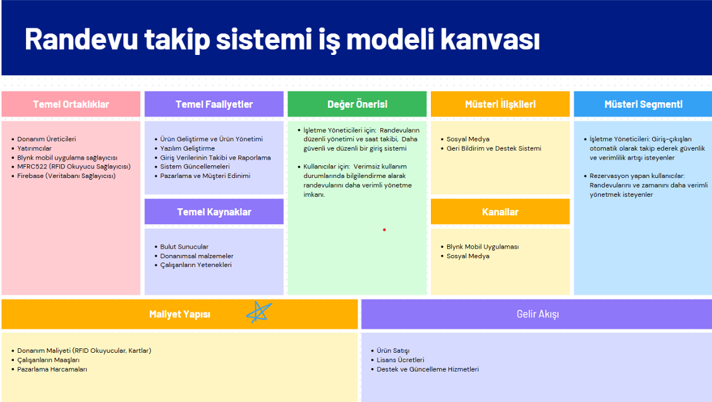
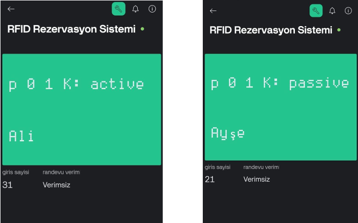

# Access-Control-System-IOT-project

Nowadays, managing reservations and maintaining an organized access system in places like libraries has become a crucial necessity. This project proposes an RFID-based access control system.
The main problems this project focuses on are as follows:

Access Control: Ensuring that only authorized individuals can enter designated areas, such as libraries, at their scheduled times while preventing unauthorized access.

Security and Management: Traditional entry methods are difficult to control and inefficient. Unauthorized access may lead to security risks. Additionally, tracking users' entry frequency and ensuring efficient use of the space can be challenging for management.

Efficiency: Enabling users to utilize the space more effectively through a reservation system; identifying users who enter too frequently or exceed their scheduled time and preventing such occurrences.

To address these issues, an RFID-based access control system is proposed. This system tracks reservations, allows users to enter at specific times, and performs efficiency measurements to enhance management effectiveness.

### Project Team    
- Zeynep Uysal (me:)
- [Sadettin Kaya](https://github.com/Sadettinkaya?fbclid=PAZXh0bgNhZW0CMTEAAaYjIPO5lrBqg4h3m9ntRZHnXYK1_zPsOLLXkxXWbVqQ-fyjM8_MlNu2H48_aem_B18wNjyLhFgaQJaQtG_0Hw)
  
### Technologies Used
- NodeMcu ESP8266
- Arduino IDE
- Blynk Application
- RFID Card
- Firebase

  
### Business Canvas Model

### Blynk Ekranından Görseller

.

.

.

